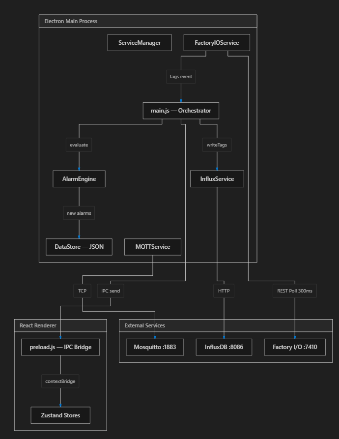

# INDUS — Plateforme Industrielle Intégrée

**SCADA / HMI / MES / GMAO** — Application desktop temps réel connectée à des protocoles industriels (OPC-UA, Modbus TCP, MQTT) avec stockage de séries temporelles (InfluxDB), simulation de capteurs, maintenance prédictive et jumeau numérique 3D.

    

---


[](screenshots/demo.mp4)
*Cliquez sur l'image pour voir la démo vidéo*

## Architecture

```
┌──────────────────────────────────────────────────┐
│               Electron Main Process               │
│                                                    │
│  Simulation    Prediction    Alarm     DataStore  │
│  Engine        Engine        Engine    (SQLite)   │
│                                                    │
│  OPC-UA  │  Modbus  │  MQTT  │  InfluxDB  │  FIO  │
│  Client   │  Client  │  Client│  Client     │Client │
│                                                    │
│                   IPC Bridge                        │
└──────────────────────┬────────────────────────────┘
                       │
┌──────────────────────┴────────────────────────────┐
│              React Renderer (Vite)                 │
│                                                    │
│  Dashboard │ SCADA │ GMAO │ MES │ DigitalTwin    │
│  Analytics │ Settings                              │
└────────────────────────────────────────────────────┘
```

## Modules

| Module | Description |
|--------|-------------|
| **Dashboard** | Vue d'ensemble avec KPIs temps réel, diagramme synoptique, jauges et tendances |
| **SCADA** | Supervision avec alarmes ISA-18.2, historique, vues synoptiques |
| **GMAO** | Gestion de Maintenance Assistée par Ordinateur — ordres de travail, actifs, planification |
| **MES** | Manufacturing Execution System — OF, OEE (TRS), arrêts |
| **Digital Twin** | Jumeau numérique 3D (Three.js/React Three Fiber) avec vue atelier |
| **Analytics** | Analyse des données historiques (ECharts), maintenance prédictive (RUL) |
| **Settings** | Configuration des connexions (OPC-UA, Modbus, MQTT, InfluxDB, Factory I/O) |

## Protocoles Industriels

| Protocole | Rôle | Port par défaut |
|-----------|------|----------------|
| **OPC-UA** | Lecture/écriture de tags serveur OPC-UA | `opc.tcp://localhost:4840` |
| **Modbus TCP** | Lecture registres holding (12) + coils (5), écriture | `localhost:502` |
| **MQTT** | Publication/abonnement topics, bridge capteurs | `localhost:1883` |
| **Factory I/O** | REST API + OPC-UA avec Factory I/O | `localhost:7410` |
| **InfluxDB 2.x** | Stockage séries temporelles, requêtes Flux | `localhost:8086` |

## Tags Simulation (14 capteurs)

Le moteur de simulation intégré génère des données réalistes pour 14 tags industriels avec cycles de production (démarrage, régime nominal, arrêt) et injection d'anomalies programmable (dérive lente, pics, oscillations, pannes).

- Température cuve (PT100)
- Pression ligne (4-20mA)
- Débit sortie
- Niveau cuve
- Vibration moteur principal
- Courant moteur principal
- Vitesse convoyeur
- Température moteur secondaire
- Pression hydraulique
- Position vanne de régulation
- Taux de défauts
- Température environnement
- Humidité environnement
- Compteur de pièces

## Prérequis

- [Node.js](https://nodejs.org/) 18+
- npm 10+
- (Optionnel) [InfluxDB 2.x](https://portal.influxdata.com/downloads/) pour la persistance
- (Optionnel) [Mosquitto](https://mosquitto.org/download/) pour MQTT externe
- (Optionnel) [Factory I/O](https://factoryio.com/) pour simulation 3D

## Installation

```bash
# Cloner le dépôt
git clone https://github.com/Youssef-AMARZOU/scada-hmi.git
cd scada-hmi

# Installer les dépendances
npm install

# Rebuild Electron (nécessaire si binaire corrompu)
node node_modules/electron/install.js
```

## Démarrage Rapide

### Option 1 : Tout-en-un (recommandé)

```bash
start-all.bat
```

Lance : InfluxDB + serveur OPC-UA local + serveur Modbus local + Vite + Electron

### Option 2 : Développement

```bash
# Terminal 1 — serveurs locaux (OPC-UA:4840 + Modbus:502)
start-servers-only.bat

# Terminal 2 — application
npm run electron:dev
```

### Option 3 : Production

```bash
npm run build
npx electron .
```

### Option 4 : Silencieux (VBS)

Double-cliquez sur `start-all.vbs` — tout démarre en arrière-plan avec une boîte de confirmation.

## Scripts npm

| Commande | Description |
|----------|-------------|
| `npm run dev` | Serveur Vite seul (sans Electron) |
| `npm run build` | Build production Vite |
| `npm run electron` | Lance Electron en mode production |
| `npm run electron:dev` | Vite + Electron avec rechargement à chaud |

## Configuration

Les paramètres sont stockés dans `%APPDATA%\indus\indus-data\store.json`.

### Connexions par défaut

```json
{
  "opcua": { "url": "opc.tcp://localhost:53530", "autoConnect": true },
  "modbus": { "host": "127.0.0.1", "port": 502, "unitId": 1, "pollInterval": 1000 },
  "mqtt": { "url": "mqtt://localhost:1883", "autoConnect": true },
  "influxDB": { "url": "http://localhost:8086", "token": "...", "org": "indus", "bucket": "factory-data", "autoConnect": true },
  "factoryIO": { "url": "http://localhost:7410", "pollInterval": 300, "autoConnect": true },
  "simulation": { "enabled": true, "interval": 1000 }
}
```

## Structure du Projet

```
INDUS/
├── electron/
│   ├── main.js                    # Process principal Electron + IPC
│   ├── preload.js                 # API bridge (OPC-UA, Modbus, MQTT, InfluxDB, etc.)
│   └── services/
│       ├── simulation-engine.js   # Moteur de simulation temps réel (14 tags)
│       ├── opcua-service.js       # Client OPC-UA avec reconnexion
│       ├── modbus-service.js      # Client Modbus TCP (jsmodbus)
│       ├── mqtt-service.js        # Client MQTT avec abonnement
│       ├── influx-service.js      # Client InfluxDB 2.x
│       ├── factoryio-service.js   # Client Factory I/O REST API
│       ├── alarm-engine.js        # Moteur d'alarmes ISA-18.2
│       ├── data-store.js          # Persistance SQLite locale
│       └── service-manager.js     # Orchestrateur de services
├── scripts/
│   ├── local-opcua-server.js      # Serveur OPC-UA local (14 tags, port 4840)
│   ├── local-modbus-server.js     # Serveur Modbus TCP local (12 regs + 5 coils)
│   ├── start-influxdb.bat         # Démarrage InfluxDB
│   ├── setup-infra.ps1            # Script d'installation infrastructure
│   └── start-services.ps1         # Lancement services PowerShell
├── src/
│   ├── main.jsx                   # Point d'entrée React
│   ├── App.jsx                    # Routage (HashRouter, 7 modules)
│   ├── App.css                    # Thème dark industriel (JetBrains Mono)
│   ├── i18n/                      # Internationalisation (fr, en)
│   │   ├── fr.json
│   │   ├── en.json
│   │   └── index.js
│   ├── stores/
│   │   └── index.js               # Zustand stores (app, tags, alarms, MES, GMAO, history)
│   ├── components/
│   │   └── Layout/                # Mise en page (sidebar, header, breadcrumb)
│   └── modules/
│       ├── Dashboard/             # Vue d'ensemble temps réel
│       ├── SCADA/                 # Supervision et alarmes
│       ├── GMAO/                  # Maintenance (OT, actifs)
│       ├── MES/                   # Production (OF, OEE, arrêts)
│       ├── DigitalTwin/           # Jumeau numérique 3D
│       ├── Analytics/             # Analyse et maintenance prédictive
│       └── Settings/              # Configuration connexions
├── public/
│   ├── favicon.svg
│   └── icons.svg
├── dist/                          # Build de production (généré)
├── start-all.bat                  # Lancement complet (console)
├── start-all.vbs                  # Lancement complet (silencieux)
├── start-servers-only.bat         # Lancement serveurs uniquement
├── docs/
│   ├── CAHIER_DES_CHARGES.md      # Cahier des charges détaillé
│   └── INFLUXDB_TOKEN.md          # Guide récupération token InfluxDB
├── package.json
└── vite.config.js
```

## API Electron (Preload)

L'API est exposée via `window.electronAPI` dans le renderer :

```js
// OPC-UA
window.electronAPI.opcua.connect(url)
window.electronAPI.opcua.read(nodeId)
window.electronAPI.opcua.write(nodeId, value, dataType)

// Modbus
window.electronAPI.modbus.connect({ host, port, unitId })
window.electronAPI.modbus.writeRegister(address, value)
window.electronAPI.modbus.writeCoil(address, value)

// MQTT
window.electronAPI.mqtt.publish(topic, payload)

// InfluxDB
window.electronAPI.influx.query(fluxQuery)

// Simulation
window.electronAPI.simulation.start(interval)
window.electronAPI.simulation.injectAnomaly(name, type, duration)
window.electronAPI.simulation.getOEE()
window.electronAPI.simulation.getPredictions()

// Alarms
window.electronAPI.alarms.setThresholds(thresholds)
window.electronAPI.alarms.getAll()

// GMAO / MES
window.electronAPI.gmao.saveWorkOrder(wo)
window.electronAPI.mes.saveProductionOrder(po)
```

## Services Externes

### InfluxDB
- Téléchargement : [InfluxDB 2.x OSS](https://portal.influxdata.com/downloads/)
- Installation : Extraire dans `%LOCALAPPDATA%\influxdb2\`
- Premier lancement : auto-setup via l'API (`admin / indusadmin2026!`)
- Interface web : http://localhost:8086

### Mosquitto (MQTT)
- Téléchargement : [Mosquitto](https://mosquitto.org/download/)
- Service système Windows ou exécutable manuel

### Factory I/O
- Logiciel de simulation 3D d'usine avec sorties OPC-UA et REST API

## Licence

MIT
